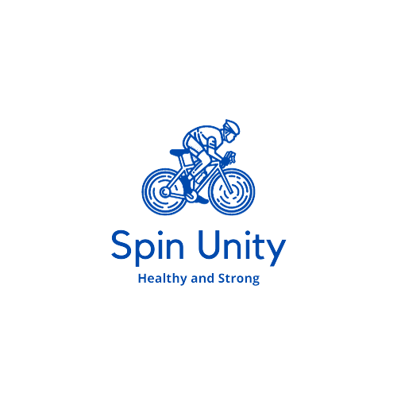

# :bicyclist: SPIN UNIT Laravel App
<div id="top" align="center">
  
<h3 align="center">SPIN UNIT Laravel App</h3>
  
  <p align="center">
This is the official SPIN UNIT documentation <br/>
  </p>
 </div>

  
  

<!-- TABLE OF CONTENTS -->
<details>
  <summary>Table of Contents</summary>
  <ol>
    <li>
      <a href="#-about-the-project">About The Project</a>
      <ul>
        <li><a href="#-project-main-features">Project Main Features</a></li>
        <li><a href="#-project-technical-architecture">Project Technical Architecture</a></li>
        <li><a href="#-built-with">Built With</a></li>
      </ul>
    </li>
    <li>
      <a href="#-getting-started">Getting Started</a>
      <ul>
        <li><a href="#-prerequisites">Prerequisites</a></li>
        <li><a href="#-installation">Installation</a></li>
      </ul>
    </li>
    <li><a href="#-usage">Usage</a></li>
    <li><a href="#-roadmap">Roadmap</a></li>
    <li><a href="#-contributing">Contributing</a></li>
    <li><a href="#-contact">Contact</a></li>
    <li><a href="#-acknowledgments">Acknowledgments</a></li>

  </ol>
</details>


<!-- ABOUT THE PROJECT -->
## 📃 About The Project
<b>"SPIN UNIT</b>the ultimate platform for cycling enthusiasts and advocates of eco-friendly transportation! At SpinUnity, we believe in the power of cycling to transform lives and contribute to a sustainable future.
<br/>
Our mission is simple yet impactful: to connect and empower individuals who share a passion for bicycles. We strive to promote cycling as more than just a mode of transport—it's a lifestyle that benefits both individuals and the planet.<br>

 ### 📜 Project Main features
1. **:bike: Bikes Management** 
2. **:euro: Bike Shop**
3. **:reminder_ribbon: Associations Management** 
4. **:bicyclist: Event Rides Management**
5. **:flags: Achievements Management** 
6. **🙋 Users Management** 
<p align="right">(<a href="#top">back to top</a>)</p>


### 🚀 Built With

**SPIN UNIT APP** is built using Laravel Framework. You may find below the list of the frameworks/libraries that we used to build our project :
<br/>


  <div align="center">

	
 <a href="https://laravel.com">
    
  </a>
	
  <a href="https://jetstream.laravel.com">
    
 </a>
	
   <a href="https://www.mysql.com/fr/">
    
    </a>
  </div>
  
<p align="right">(<a href="#top">back to top</a>)</p>


<!-- GETTING STARTED -->
## ✨ Getting Started
To get a local copy up and running follow these simple example steps.

### 🚧 Prerequisites

You may find below the list of things you need to use this project :
* Make sure MySQL is running on your system.
* You will need to install the "yarn" or "npm" command line.

### 🛠 Installation

_In order to install the app you need to follow the instructions below :_

1. Clone the repo
   ```sh
   git clone https://github.com/HamzaAjili/spin-unit
   ```
   
2. Install project dependencies
   ```sh
   composer install
   ```
   
3. Install NPM packages dependencies 
   ```sh
   npm install && npm run dev
   ```
4. Rename **.env.example** file to **.env** on the root folder. 
5. Open your **.env** file and change the database name **DB_DATABASE** to whatever you have, username **DB_USERNAME** and password **DB_PASSWORD** field correspond to your configuration. Also don't forget to set **MAIL_USERNAME** and **MAIL_PASSWORD** values .
 
   
7. Generate key to set APP_KEY value in .env 
   ```sh
   php artisan key:generate
   ```
   
8. Migrate the database
   ```sh
   php artisan migrate
   ```
   
9. Run the server on 
   ```sh
   php artisan serve
   ```
10. Open localhost:8000 in the browser and that's it you can enjoy the project 🎉!

 

<p align="right">(<a href="#top">back to top</a>)</p>


<!-- USAGE EXAMPLES -->
## ⚡ Usage

| <br> **Login Page**|   <br>**Register Page**| 
| ------------- | ------------- | 


<p align="right">(<a href="#top">back to top</a>)</p>


<!-- ROADMAP -->
## 🚩 Roadmap

See the [open issues](https://github.com/ahlem-phantom/AI-HealthCare-Assistant/issues) for a list of proposed features (and known issues).

 - [x] Phase 1 : Template Integration using Blade
	 - Frontoffice template
	 - Backoffice template

- [x] Phase 2 : Authentication Integration using JetStream
	- User Authentication
	- User Profile Management
	- Password Update
	- Password Confirmation
	- Account mail verification

- [ ] Phase 3 : CRUD Integration
  - Bikes Management 
  - Bike Rentals Management
  - Bike Associations Management
  - Bike Rides Management
  - Bike Events Management


  
<p align="right">(<a href="#top">back to top</a>)</p>


<!-- CONTRIBUTING -->
## 😎 Contributing

If you have a suggestion that would make this project better, please fork the repo and create a pull request. Any contributions you make are **greatly appreciated**.
Don't forget to give the project a star! Thanks again!

1. Fork the Project
2. Create your Feature Branch (`git checkout -b Yourbranch`)
3. Commit your Changes (`git commit -m 'Add some features to project'`)
4. Push to the Branch (`git push origin Yourbranch`)
5. Open a Pull Request

<p align="right">(<a href="#top">back to top</a>)</p>


<!-- CONTACT -->
## 💌 Contact


<p align="right">(<a href="#top">back to top</a>)</p>


<!-- ACKNOWLEDGMENTS -->
## 🙌 Acknowledgments

* [Choose an Open Source License](https://choosealicense.com)
* [GitHub Emoji Cheat Sheet](https://www.webpagefx.com/tools/emoji-cheat-sheet)
* [Img Shields](https://shields.io)
* [GitHub Pages](https://pages.github.com)
* [Font Awesome](https://fontawesome.com)

<p align="right">(<a href="#top">back to top</a>)</p>

